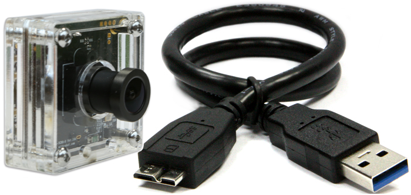

# Stereoscopic Vision

### Overview

The goal of this research was to intuitively teach Edwin to recognize and remember objects, thus creating a robust tool for dataset generation. This decreased the amount of time we would need to spend generating datasets of individual objects for any future machine learning.

In order to identify objects we were interested in "teaching" to Edwin, we developed a stereoscopic camera system that could locate an objects distance from Edwin. We then tagged any objects closer than a certain distance as "significant."

### The Hardware

  Starting this project, we weren't sure what features our prospective cameras would need.
  We ultimately chose the Hardkernal oCam both because it was a relatively high quality camera (which could be focused to different distances) and because we had a pair of oCams from a previous project (allowing us to start experimenting  with vision right away.)

#### Our Cameras
  
  
  
  Hardkernel oCam
  
  - standard M12 lens
  - 3.6mm focal length
  - 65 deg. field of view (FOV)
  - 120 frames per second (fps) at a resolution of 640x480 pixels
  - 5 megapixels (MP)
  - Micro-USB 3.0 connection port
  - 35 grams
  - $99 USD + shipping

#### The mount

  We originally planned to hold the oCams steady by CADing and 3D printing two mounts to hold them snugly. We then fixed the mounts in place relative to each other by bolting them to a piece of sheet metal cut to size.
  
  *Insert diagram* *Insert CAD model*
  
  The bolts weren't sufficient to keep the mounts from shifting minutely, though, and this resulted in offsets in camera calibration. In the end, we merged the two camera mounts into one unified, 3D printed mount. 
  
  *Insert CAD model*
  
  This was a better solution, as the single mount was structurally stiffer than two constrained single camera mounts.

### The Software

#### OpenCV

##### Optical Flow

##### Color Detection

##### 

*This page is under construction. Last edited on 1/29/17 by [L. Zuehsow](https://github.com/Oktober13).*
